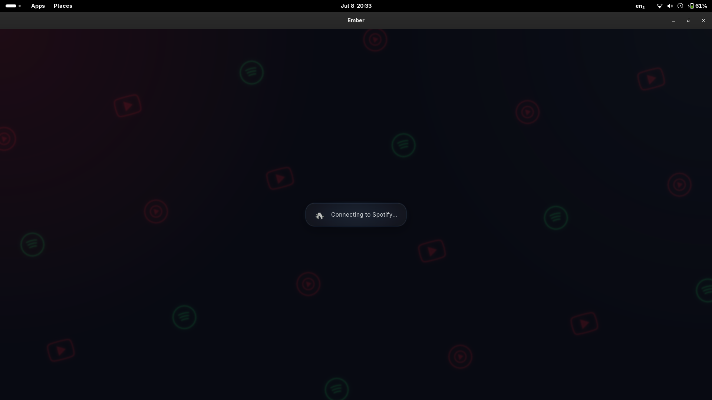
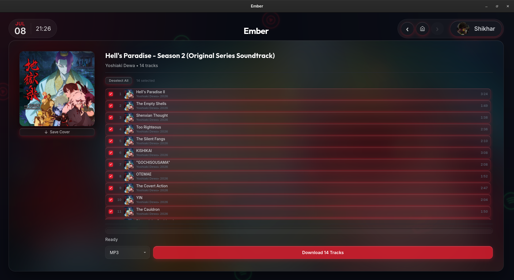
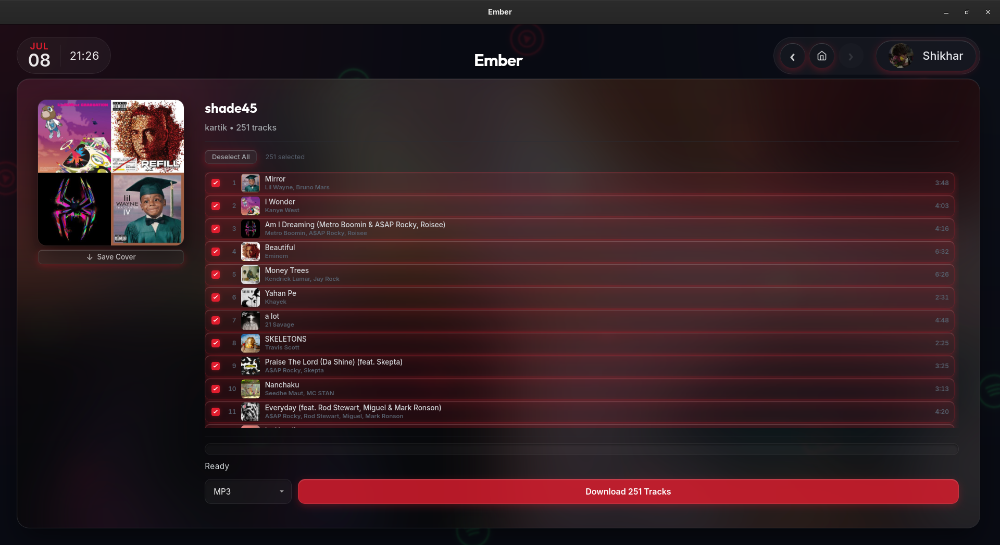
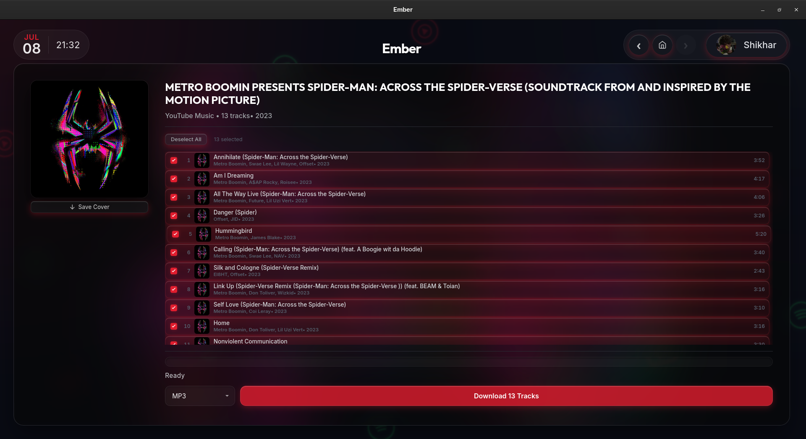
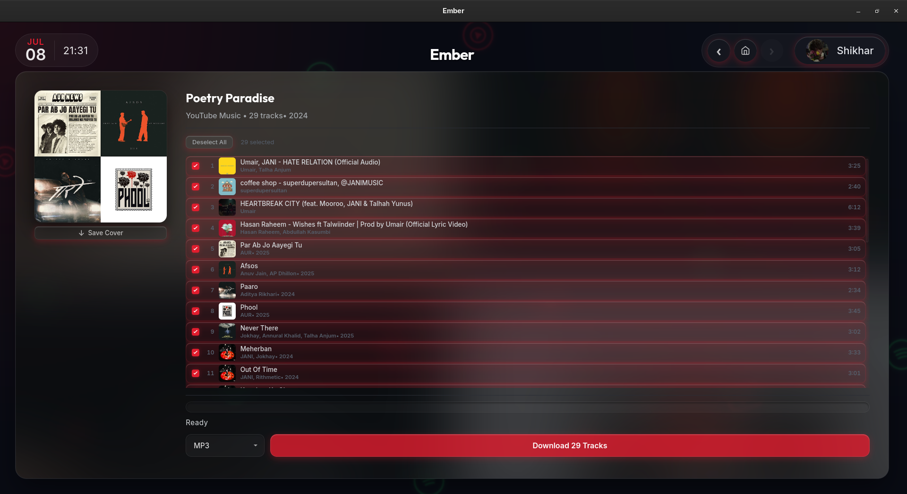
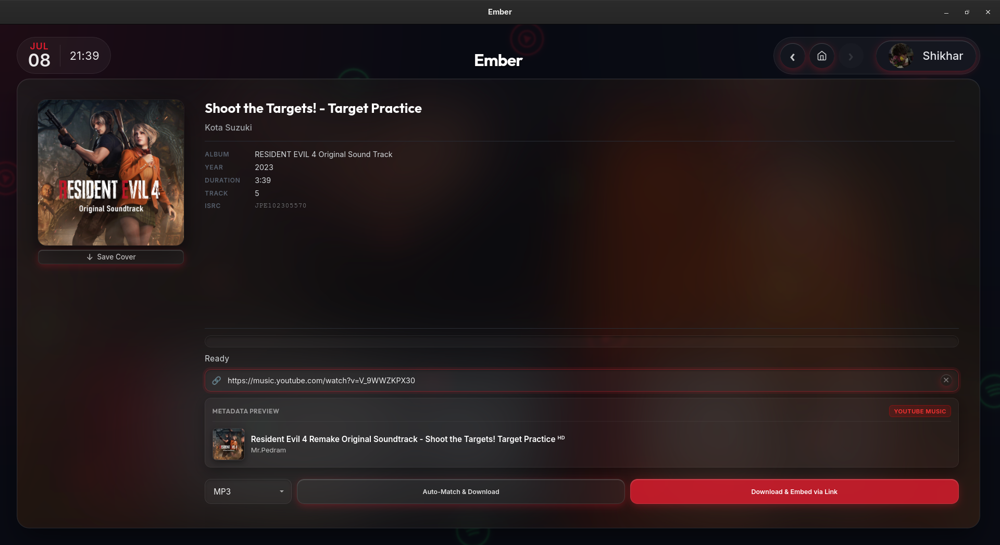
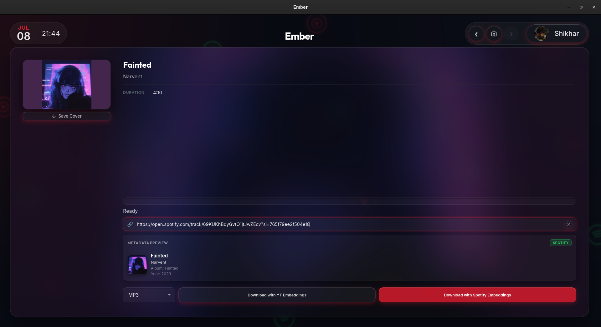
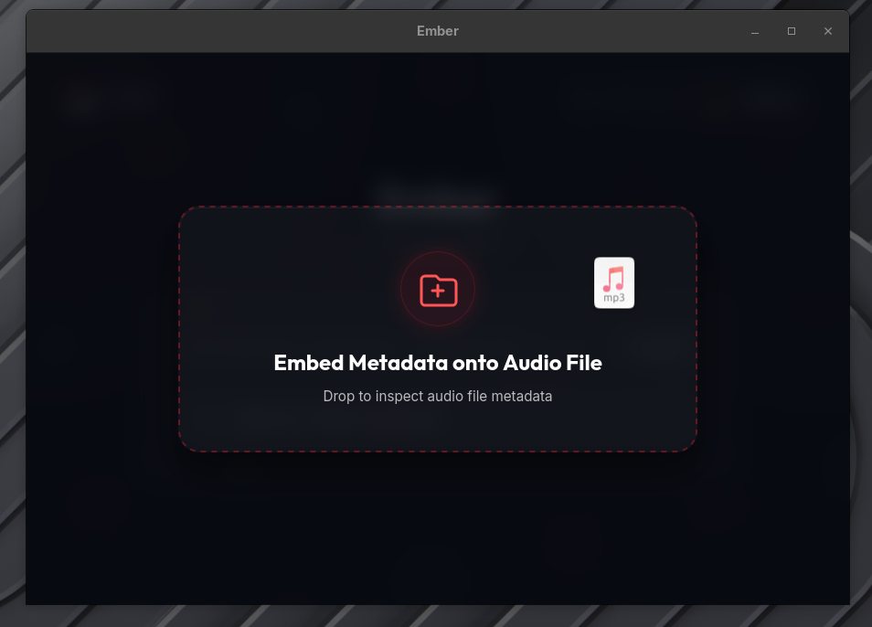
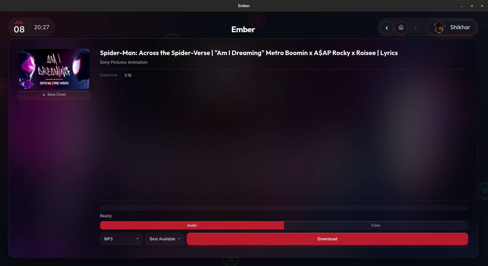
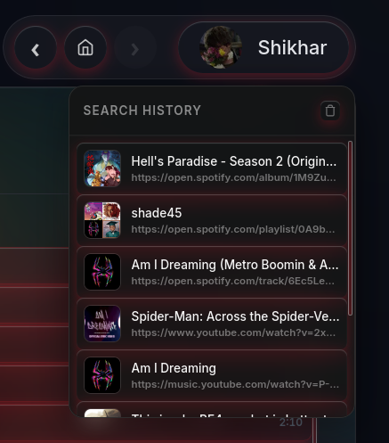

# Ember

Paste a Spotify, YouTube, or YouTube Music link. Get a tagged, high-quality audio file. 
That's it.

Ember matches Spotify tracks to the best available YouTube source using ISRC codes and 
fuzzy audio/title matching, then embeds full metadata: cover art, artist, album, track 
number, ISRC, directly into the file.















## Quick Start

**1. Install prerequisites:** Python 3.13+, Node.js, Rust/Cargo (stable), and a 
Chromium-based browser (Brave, Chrome, or Edge) logged into Spotify.

**2. Run the setup script:**

```bash
# Linux/macOS
chmod +x setup.sh && ./setup.sh

# Windows
setup.bat
```

**3. Launch:**

```bash
cd frontend
npm run tauri dev
```

On first launch, a browser window may open automatically, click **"Web Player"** so 
Ember can capture your Spotify session. This only happens once.

## Features

- **Paste-and-go**: Spotify tracks, albums, and playlists; YouTube Music tracks, 
  albums, and playlists; or a plain YouTube link
- **ISRC-based matching**: uses International Standard Recording Codes where available 
  to precisely match Spotify tracks to YouTube audio, falling back to fuzzy title/artist/
  duration scoring otherwise
- **Batch downloads**: full albums and playlists, downloaded concurrently
- **Full ID3/metadata tagging**: cover art, artist, album, track number, year, genre, ISRC
- **Manual pairing**: cross-link a Spotify track with a specific YouTube upload, or a 
  YouTube Music track with Spotify metadata, if auto-matching picks the wrong source
- **Metadata embedding**: apply Spotify or YouTube Music metadata onto an existing local 
  audio file without re-downloading
- **Multiple output formats**: MP3, FLAC, M4A, OGG, OPUS, WAV

## Tech Stack

| Layer | Technology |
|---|---|
| Frontend | SvelteKit, TypeScript |
| Desktop Shell | Tauri (Rust) |
| Backend | Python, FastAPI |
| Audio | yt-dlp, Mutagen, FFmpeg |
| Metadata | Spotify GraphQL (Pathfinder), YouTube Music (ytmusicapi)|

## Architecture

- **Rust (Tauri)** manages the native window and the Python backend's process lifecycle.
- **Python (FastAPI)** runs as a sidecar on `127.0.0.1:8008`, handling metadata 
  resolution, matching, downloading, and tagging.

The frontend talks to the backend over localhost HTTP and polls `/status` during 
startup to show connection progress.

## How authentication works

Ember doesn't use Spotify's public developer API, that API can't do audio matching or 
expose the metadata this app needs. Instead, it captures your existing Spotify web 
session (via your browser's cookies) and uses it to call Spotify's own internal GraphQL 
endpoints, the same ones the Spotify web player uses. YouTube Music metadata is fetched 
separately via `ytmusicapi` and doesn't require a Google login.

This means Ember depends on Spotify's internal API shape staying consistent. If Spotify 
changes it, metadata fetching can break until Ember is updated. When that happens, 
you'll typically see a clear error or a "log in again" prompt rather than a silent 
failure, Ember auto-retries and re-harvests your session when a token gets rejected.

## Building from Source

```bash
pyinstaller ember-backend.spec
cd frontend
npm run tauri:build
```

## Troubleshooting

- **Backend fails to start**: confirm `.venv` exists and dependencies installed 
  (`./setup.sh` / `setup.bat` handles this automatically).
- **Stuck on "Connecting to Spotify..."**: make sure you're logged into Spotify in 
  Brave, Chrome, or Edge, then use the **Try Again** button in the app.
- **Windows profile lock error**: Ember copies your browser profile to a temp 
  directory rather than using it directly, so you generally don't need to close your 
  browser first (though on Windows you might still sometimes need to close active browser window(s) if a lock persists).

## License

MIT: see [LICENSE.txt](LICENSE.txt).
