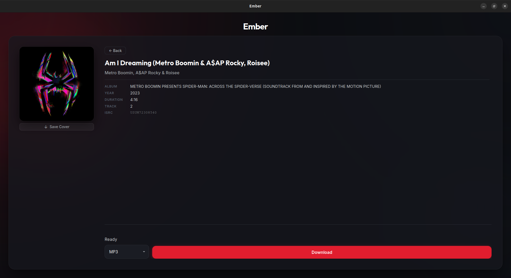

# Ember
A desktop app that downloads music and video from Spotify and YouTube, with proper metadata tagging and cover art.

---

## What it does
Ember lets you download anything from Spotify or YouTube by just pasting a link. For Spotify tracks, albums, and playlists, it finds the best matching audio from YouTube, downloads it, and embeds all the metadata (title, artist, album, cover art, ISRC, and more). For YouTube links, you can grab just the audio or the full video, and it works with both regular videos and Shorts. More sources may be supported in future updates.

- Download Spotify tracks, albums, and playlists
- Download YouTube videos as audio (MP3) or video (MP4), including Shorts
- Multiple audio format options: MP3, FLAC, M4A, OGG, OPUS, WAV
- Automatic metadata tagging with cover art embedded
- Clean desktop UI built with Tauri and SvelteKit



---

## Architecture
Ember started as a pure Python application. The backend (everything from resolving Spotify metadata to downloading and tagging audio) was already built in Python, making use of libraries like yt-dlp, mutagen, and requests that have no real equivalent in Rust. Rather than rewrite any of that, a Tauri frontend was added on top as a desktop UI wrapper, with SvelteKit handling the interface.

The two sides communicate over HTTP on localhost:8008. When you interact with the UI, the Tauri frontend sends requests to a FastAPI server running in the background as a local Python process. The Rust layer starts and manages that Python process on launch, and shuts it down cleanly when the app closes.

This means the Python backend handles all the heavy work, and the frontend is purely responsible for what you see and interact with.

---

## Prerequisites
- Python 3.13
- Node.js and npm (latest)
- Rust and Cargo (latest)
- A Chromium-based browser. Brave is recommended, but Chrome, Chromium, and Edge also work. Ember will automatically find whichever one is installed. The only requirement is that you are logged into Spotify in that browser, as Ember harvests its authentication token from it on startup.

---

## How Authentication Works
Ember never asks you to enter your Spotify username or password. Instead, it borrows the login session you already have in your browser.

When Ember starts up, it quietly opens your browser in the background, visits the Spotify web player, and captures the authentication token that Spotify's own website uses to make requests. This token is then cached locally so the process only needs to happen once every hour or so.

If for any reason that process fails, Ember falls back to Spotify's public embed player, which works without any login at all. The embed fallback gives slightly less metadata but still gets the job done for most tracks.

The only thing required from you is that you are logged into Spotify in your browser before launching Ember.

---

## Setup

Clone the repository:
```
git clone https://github.com/shikhar0x/ember
cd ember
```

Create a virtual environment and install Python dependencies:
```
python -m venv .venv
```
On Linux/macOS:
```
source .venv/bin/activate
```
On Windows:
```
.venv\Scripts\activate
```
```
pip install -r requirements.txt
```

Install frontend dependencies:
```
cd tauri-app
npm install
```

**Running the app**

There are two ways to run Ember:

Option 1 - Python GUI (simpler):
```
python gui_app.py
```
This launches the full app in a single command. The backend starts automatically.

Option 2 - Tauri dev mode:
Open two terminals. In the first, start the Python backend:
```
python -m core.api.server
```
In the second, start the Tauri frontend:
```
cd tauri-app
npm run tauri dev
```

No platform-specific setup is needed. Ember handles all OS differences automatically.

---

## Usage

1. Launch Ember using either method from the Setup section.
2. Paste a Spotify or YouTube link into the input field and press Enter or click Inspect.
3. Ember will fetch the metadata and show you the track, album, or playlist details.
4. For Spotify, choose your preferred audio format from the dropdown: MP3, FLAC, M4A, OGG, OPUS, or WAV.
5. For YouTube, choose between audio only (MP3) or full video (MP4), and select a quality.
6. Click Download and wait for it to finish.

Downloaded files are saved to `~/Downloads/Ember/` by default. Playlists and albums get their own subfolder, for example `~/Downloads/Ember/My Playlist/`.

---

## Project Structure

```
Ember/
├── core/                  # Python backend: API, downloaders, metadata, and resolvers
│   ├── api/               # FastAPI server, routes, schemas, and task registry
│   ├── services/          # Download orchestration for Spotify, YouTube, and media
│   └── ...                # Parsers, matchers, taggers, and utilities
├── tauri-app/             # Tauri + SvelteKit desktop frontend
│   ├── src/               # SvelteKit pages and components
│   └── src-tauri/         # Rust layer that manages the Python process
├── gui_app.py             # Standalone Python GUI, the simplest way to run Ember
├── requirements.txt       # Python dependencies
└── LICENSE.txt            # MIT License
```

---

## Known Limitations

- **Private Spotify playlists are not supported.** The embed scraping method Ember uses cannot access private playlists. Make the playlist public before pasting the link.
- **WAV downloads have no metadata.** The WAV format does not support standard metadata tags, so files downloaded in WAV will have no embedded title, artist, cover art, or any other info. Use MP3 or FLAC if metadata matters to you.
- **Only Spotify and YouTube links are supported right now.** Instagram, Twitter, Reddit, SoundCloud, and Apple Music links do not work in the current version. Support for more sources may be added in future updates.
- **Spotify's internal API may change.** Ember uses Spotify's private web API to fetch metadata quickly. If Spotify rotates certain internal values, the fast path may break temporarily and fall back to a slower method with slightly less accurate results. This can be fixed with a code update when it happens.

---

## License

Ember is licensed under the MIT License. See [LICENSE.txt](LICENSE.txt) for details.
