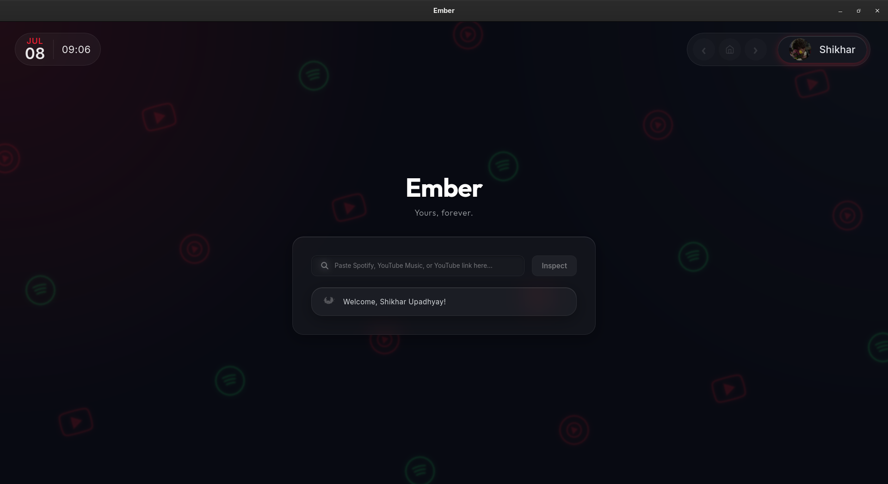

# Ember

Ember is a desktop application built with Tauri, SvelteKit, and Python for downloading music. It uses a local Python backend API to process metadata and a modern frontend interface.



## Features

- **Modern Interface**: A glassmorphism-inspired UI with physics-based animations built using SvelteKit and TypeScript.
- **Continuous Progress Tracking**: Real-time byte-level progress updates aggregated across concurrent downloads.
- **Advanced GraphQL Scraping**: Directly interfaces with internal Spotify GraphQL endpoints to instantly harvest rich, structured metadata for Tracks, Albums, and Playlists, with the public embed API acting as a robust fallback.
- **Audio Mapping**: Maps Spotify metadata to the corresponding YouTube audio stream using a dual search-and-verify algorithm.
- **Concurrent Batch Processing**: Downloads multi-track playlists in parallel using a Python worker pool that manages throttling and chunking.
- **Automatic ID3 Tagging**: Embeds high-resolution cover art, artist tags, album info, and track numbers into downloaded `.mp3` or `.m4a` files.
- **YouTube Support**: Direct extraction from YouTube video or Shorts links (MP4 or MP3).

## Architecture & IPC Flow

Ember leverages a two-tier architecture:

1. **Frontend (Tauri + SvelteKit + TypeScript)**: A reactive user interface.
2. **Backend (Python)**: A sidecar executable running a FastAPI-based local API on `127.0.0.1:8008`.

**IPC Flow**: 
The Tauri shell manages the lifecycle of the Python backend. Upon startup, Tauri verifies the backend is running by polling the `/health` endpoint. The frontend then communicates with the Python workers via HTTP requests to `localhost:8008`, while progress events are streamed back to the UI.

*Note: The repository also contains a legacy CustomTkinter GUI. To run it, activate your virtual environment (`.venv\Scripts\activate` on Windows, or `source .venv/bin/activate` on Linux/macOS) and execute `python gui_app.py`. The Tauri frontend remains the modern, primary interface.*

## Prerequisites

- Python 3.13
- Node.js and npm (latest)
- Rust and Cargo (stable)

### Windows Development

If you are building Ember from source on Windows, Rust requires the Microsoft Visual C++ Build Tools (MSVC).

Install either:
- Visual Studio Community with the Desktop Development with C++ workload
- Visual Studio Build Tools with the MSVC toolchain

### Linux Development

If you are building on Linux, you must install Tauri's system dependencies and the core build toolchain:
```bash
sudo apt update
sudo apt install libwebkit2gtk-4.0-dev build-essential curl wget file libssl-dev libgtk-3-dev libayatana-appindicator3-dev librsvg2-dev
```

### macOS Development

If you are building on macOS, you must install the Xcode Command Line Tools:
```bash
xcode-select --install
```

### Browser
A Chromium-based browser is required for Spotify authentication. Ember uses browser cookie extraction for `yt-dlp` and utilizes Playwright in `core/isrc.py` for ISRC token harvesting from `ifpi.org`.

Supported browsers include:
- Brave (recommended)
- Chrome
- Chromium
- Microsoft Edge

You must be logged into Spotify in one of these browsers before launching Ember.

## Virtual Environment Setup

Before building from source or running the development server, set up the virtual environment:

```bash
# 1. Create the virtual environment
python -m venv .venv

# 2. Activate it
# On Windows:
.venv\Scripts\activate
# On Linux/macOS:
source .venv/bin/activate

# 3. Install dependencies
pip install -r requirements.txt
```

## Building from Source

To compile the application into a standalone installer, ensure your virtual environment is **active**.

### Windows
1. **Build the Python Backend** (Requires PyInstaller):
   ```bash
   pyinstaller ember-backend.spec
   ```
   This creates a standalone sidecar executable `ember-backend.exe` in the `dist/` directory.

2. **Build the Tauri Frontend**:
   ```bash
   cd tauri-app
   npm install
   npm run tauri build
   ```
   Tauri will bundle the backend executable and generate both a standalone `.exe` and an `.msi` installer.

### Linux & macOS
Ember's rust core has full Unix process management support (using `ss`/`lsof` for port management).

1. **Build the Python Backend** (Requires PyInstaller):
   ```bash
   pyinstaller ember-backend.spec
   ```
   This creates a standalone binary `ember-backend` (without an extension) in the `dist/` directory.

2. **Update Tauri Config**:
   Open `tauri-app/src-tauri/tauri.conf.json` and change the `resources` array to point to the extensionless binary:
   ```json
   "resources": [
     "../../dist/ember-backend"
   ]
   ```

3. **Build the Tauri Frontend**:
   ```bash
   cd tauri-app
   npm install
   npm run tauri build
   ```
   Tauri will bundle the backend and generate `.AppImage` / `.deb` / `.rpm` packages on Linux, or `.app` / `.dmg` on macOS.

## Development

To run the app in development mode with hot-reloading:

```bash
cd tauri-app
npm run tauri dev
```

## Important Usage Notes

- **Initial Loading Time**: When you open Ember (especially for the first time), the initial startup sequence may take up to 30 seconds depending on your network speed, as the backend initializes its internal dependencies and browser hooks.
- **Background Popups**: On Windows, when Ember is opened, you might see a **spooky** Command Prompt flash. Additionally, if you use the Brave browser, a new browser window might pop open. You can close this Brave window manually if you'd like (or just ignore it). **Don't panic! Ember is not a virus! 😇**. It's just our automated extraction engine doing a quick ninja-run to snatch the required metadata and security cookies in the background.

## Troubleshooting

- **Backend fails to start**: Ensure the virtual environment (`.venv`) exists and all dependencies from `requirements.txt` are installed. Tauri looks specifically for the `.venv` directory to launch the API in dev mode.
- **Browser/Metadata extraction errors**: Ensure you have Chrome or Brave installed, as the extraction engine relies on them for cookie harvesting and Playwright automation.
- **Zombie processes**: The Tauri shell automatically kills orphaned backend instances on port 8008 on startup. If you experience hangs, you can manually kill processes listening on port 8008.

## License

This project is licensed under the terms specified in the [LICENSE.txt](LICENSE.txt) file.
