# Ember

Paste a Spotify, YouTube, or YouTube Music link. Get a tagged, high-quality audio or video file. That's it.

Ember matches Spotify tracks to the best available YouTube source using ISRC codes and fuzzy audio/title matching, then embeds full metadata: cover art, artist, album, track number, and ISRC directly into the file.


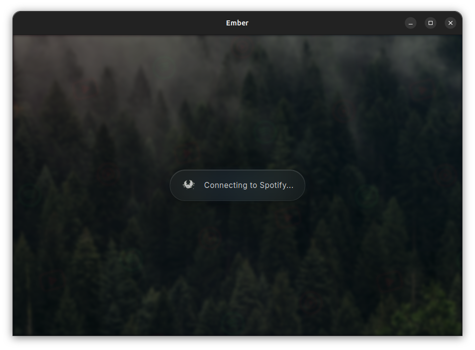
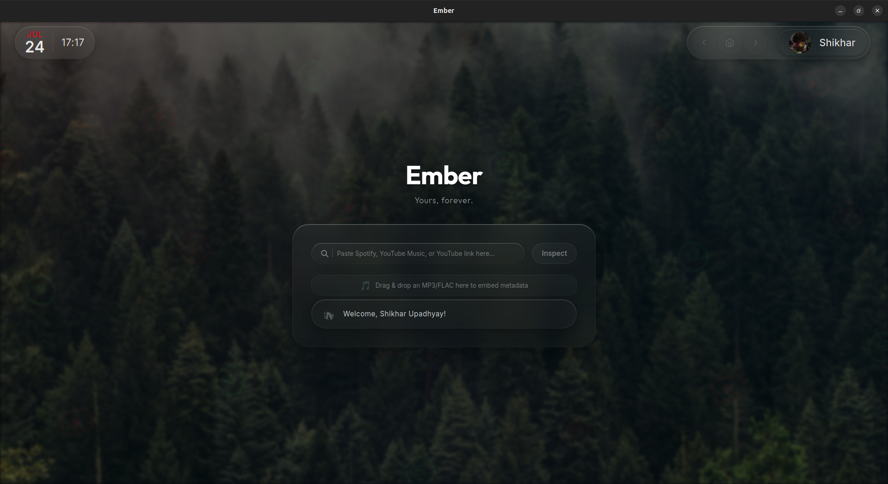
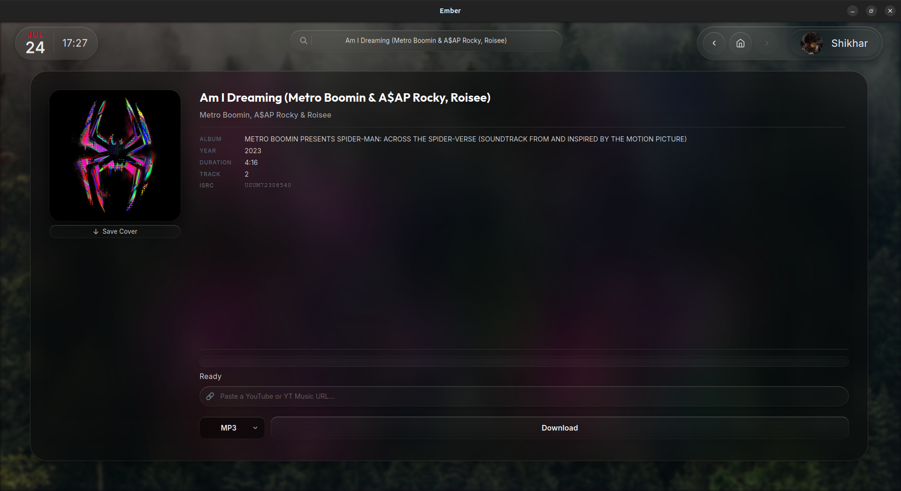
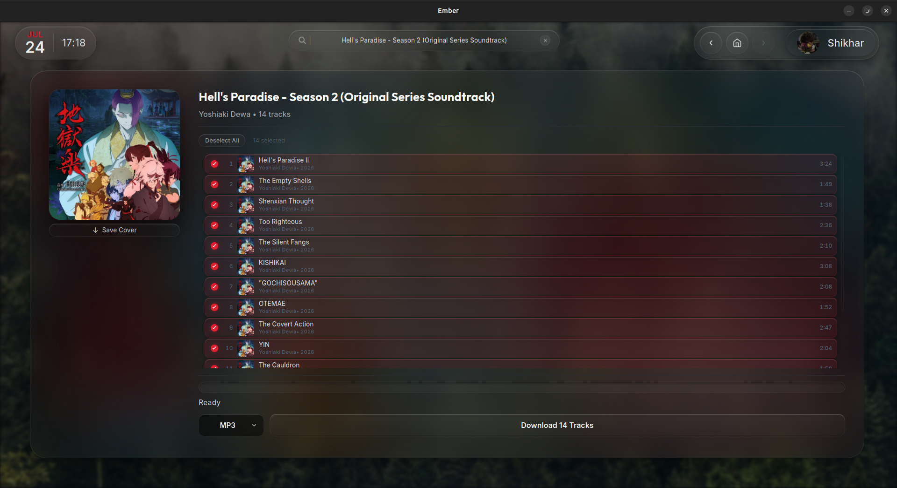
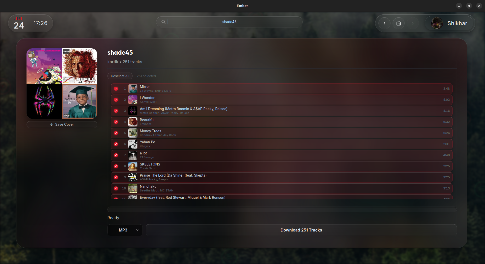
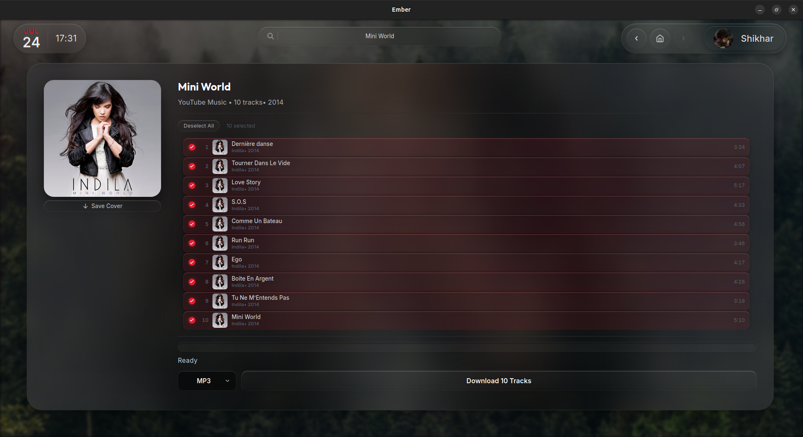
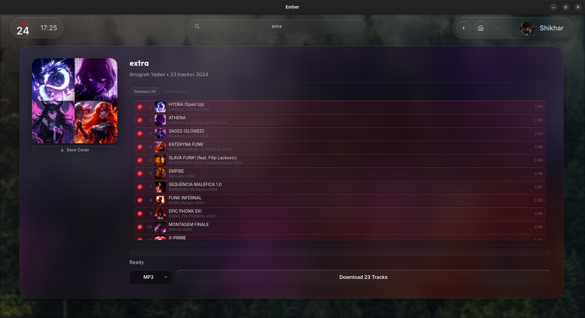
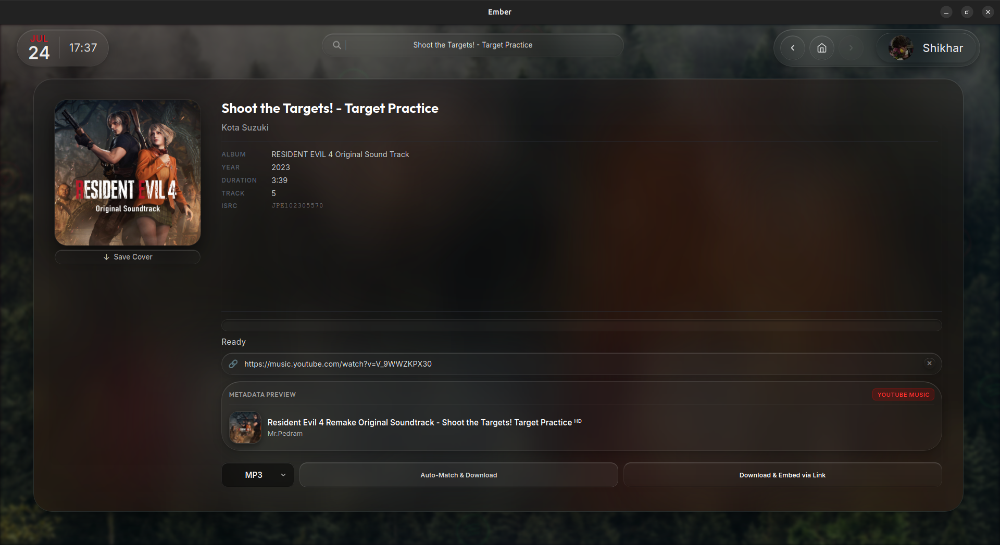
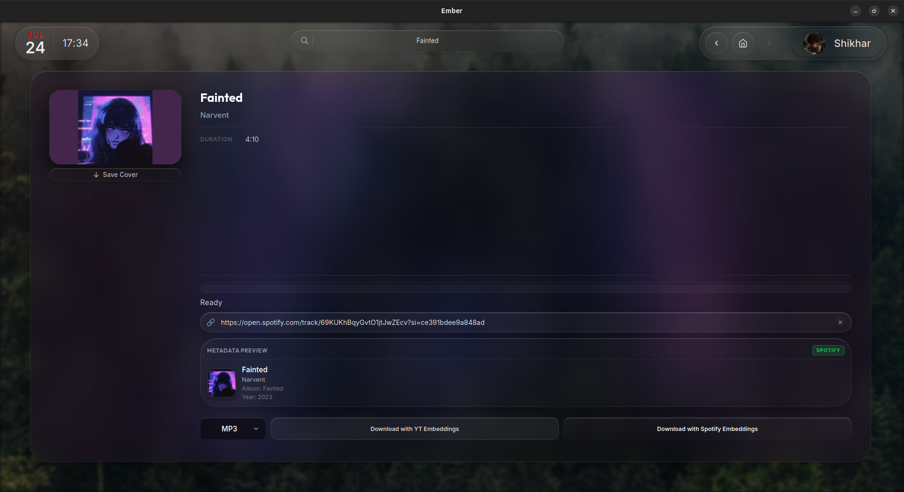
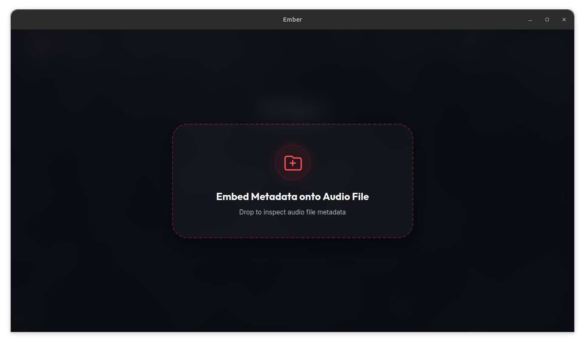
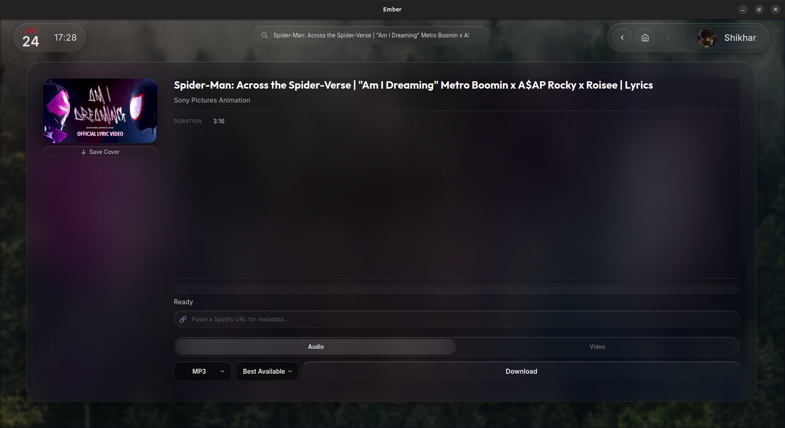
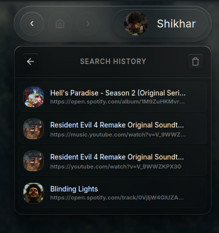

## Features

- **Paste-and-go**: Supports Spotify tracks, albums, and playlists; YouTube Music tracks, albums, and playlists; or direct YouTube links.
- **ISRC-based matching**: Uses International Standard Recording Codes where available to precisely match Spotify tracks to YouTube audio, falling back to fuzzy title/artist/duration scoring otherwise.
- **Batch downloads**: Fetch full albums and playlists concurrently with custom track selection.
- **Full ID3/metadata tagging**: Automatically embeds cover art, artist, album, track number, year, genre, and ISRC.
- **Manual pairing**: Cross-link a Spotify track with a specific YouTube upload, or pair YouTube Music with Spotify metadata if auto-matching picks the wrong source.
- **Local File Inspection & Drag-and-Drop**: Drag any local audio file (`.mp3`, `.flac`, `.m4a`, `.mp4`, `.ogg`, `.opus`) into the app to inspect its metadata, and manually pair it with Spotify/YouTube Music to embed metadata directly onto the local file.
- **Video downloads**: Download YouTube links directly as MP4 video files up to 1080p.
- **Custom audio formats & quality**: Output to MP3, FLAC, M4A, OGG, OPUS, or WAV with selectable bitrate targets (up to 320 kbps).
- **Save Cover Art**: Quick-export cover art imagery directly to your local drive.
- **Custom Themes & Wallpapers**: Personalized interface styling with curated wallpaper backgrounds, opacity, and blur settings.

## Quick Start

**1. Install prerequisites:** Python 3.13+, Node.js, Rust/Cargo (stable), and a Chromium-based browser (Brave, Chrome, or Edge) logged into Spotify.

**2. Run the setup script:**

```bash
# Linux/macOS
chmod +x setup.sh && ./setup.sh

# Windows
./setup.bat
```

**3. Launch:**

```bash
cd frontend
npm run tauri dev
```

On first launch, a browser window may open automatically. Click **"Web Player"** so Ember can capture your Spotify session. This only happens once.

## Tech Stack

| Layer | Technology |
|---|---|
| **Frontend** | SvelteKit, TypeScript, TailwindCSS/Vanilla CSS |
| **Desktop Shell** | Tauri v2 (Rust) |
| **Backend** | Python, FastAPI |
| **Audio/Video** | yt-dlp, Mutagen, FFmpeg |
| **Metadata** | Spotify GraphQL (Pathfinder), YouTube Music (ytmusicapi), iTunes/Apple Music API |

## Architecture

- **Rust (Tauri)** manages the native desktop window, file drag-and-drop events, and the Python backend's sidecar process lifecycle.
- **Python (FastAPI)** runs as a local sidecar on `127.0.0.1:8008`, handling metadata resolution, matching, downloading, and tagging.

The frontend communicates with the backend over localhost HTTP and polls `/status` during startup to show connection progress.

## How Authentication Works

Ember doesn't use Spotify's public developer API, as it doesn't expose the underlying metadata and matching tokens needed. Instead, it captures your existing Spotify web session (via your browser's cookies) and uses it to call Spotify's internal GraphQL endpoints (the same ones the Spotify web player uses). YouTube Music metadata is fetched separately via `ytmusicapi` and doesn't require a Google login.

Ember depends on Spotify's internal API shape staying consistent. If Spotify changes it, metadata fetching can break until Ember is updated. When that happens, you'll see a clear error or a "log in again" prompt, and Ember will automatically retry and re-harvest your session when a token is rejected.

## Building from Source

```bash
# Build the Python sidecar backend
pyinstaller ember-backend.spec

# Build the Tauri application package
cd frontend
npm run tauri build
```

## Troubleshooting

- **Backend fails to start**: Confirm `.venv` exists and dependencies installed successfully (`./setup.sh` / `setup.bat` handles this automatically).
- **Stuck on "Connecting to Spotify..."**: Make sure you are logged into Spotify in Brave, Chrome, or Edge, then use the **Try Again** button in the app.
- **Windows profile lock error**: Ember copies your browser profile to a temp directory rather than using it directly, so you generally don't need to close your browser first (though on Windows you might still sometimes need to close active browser windows if a lock persists).

## License

MIT: see [LICENSE.txt](LICENSE.txt).

